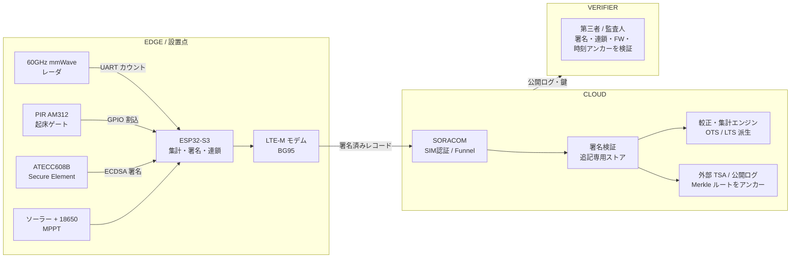
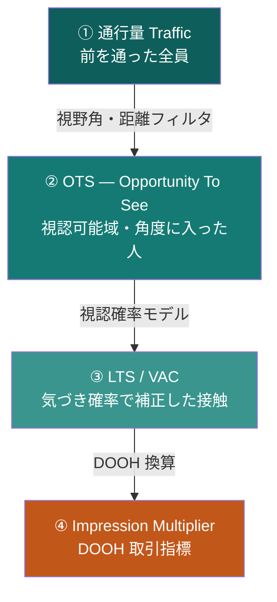
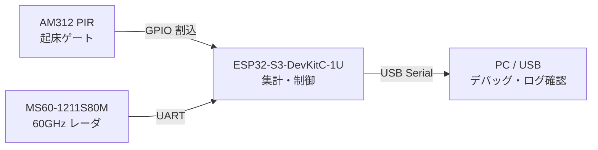
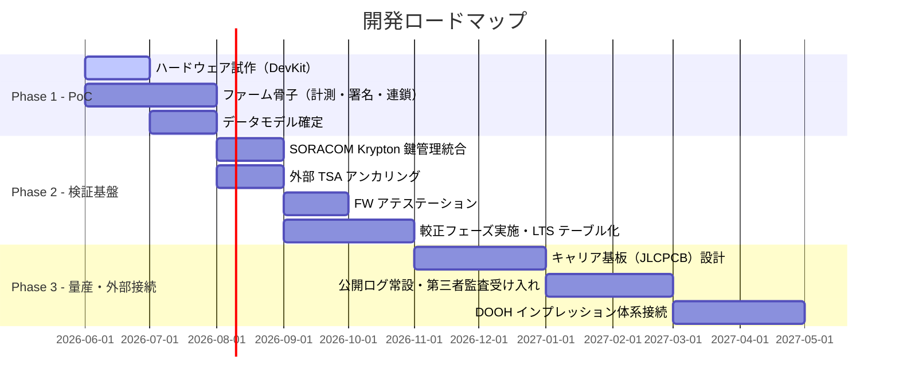

# Offline Audience Meter

> ポスター設置点のオフライン視聴者数を、プライバシーに配慮した形で計測・署名・検証する自立型 IoT センサシステム。

**halfwaytheir DOOH プロジェクト** — v0.9 Draft / 2026-06-06

---

## 概要

商用電源のないポスター設置点で人数を低電力計測し、**第三者検証可能**な形で集計・送信する。OOH/DOOH のインプレッション体系への接続を前提とする。

### 設計原則

| 原則 | 内容 |
|------|------|
| **計測は人数のみ** | 画像・特徴量を取得しない。PII ゼロ。屋外多点展開を法務的に最小負荷で実現 |
| **電源は自立** | ソーラー＋電池で常時自立稼働。全コンポーネントの選定を規定する最大制約 |
| **検証可能性は初日から** | 署名・改ざん耐性・外部アンカリングは後付け不可のため、最初から組み込む |

---

## システムアーキテクチャ



---

## 視聴者指標の階層



> デバイスが生成するのは **① 通行量の生カウント**。較正レイヤーが ②③ に変換し、④ として DOOH と統一する。

---

## PoC ハードウェア構成

現在の試作（PoC Phase）で使用するコンポーネント：

| 役割 | 部品 |
|------|------|
| MCU | ESP32-S3-DevKitC-1U（ESP32-S3-WROOM-1U N8R8） |
| 人感トリガー | AM312 ミニ焦電 PIR センサモジュール |
| 人数センサ | 60GHz ミリ波レーダ MS60-1211S80M（1T2R） |

### PoC フェーズの接続図



---

## リポジトリ構成

```
offline-audience-meter/
├── hardware/          # 回路図・BOM・PCB 設計
│   └── README.md
├── firmware/          # ESP32-S3 ファームウェア
│   └── README.md
├── cloud/             # バックエンド・データパイプライン
│   └── README.md
├── calibration/       # 較正プロトコル・係数管理
│   └── README.md
├── docs/
│   ├── spec.md        # システム設計仕様書（全体）
│   └── data-model.md  # データモデル・スキーマ定義
└── html/              # 元となった設計仕様 HTML（参考）
```

---

## 開発フェーズ



### フェーズ別の必須事項

| フェーズ | 必須項目 |
|----------|---------|
| **Phase 1**（必須） | ソース署名（§鍵管理）、ハッシュ連鎖、データモデル確定、方法論公開 |
| **Phase 2** | 外部 TSA アンカリング、FW アテステーション、較正・LTS テーブル化 |
| **Phase 3** | 公開ログ常設、第三者監査受け入れ、DOOH 正式接続・対外指標提供 |

---

## 詳細ドキュメント

- [システム設計仕様書](docs/spec.md)
- [データモデル](docs/data-model.md)
- [ハードウェア設計](hardware/README.md)
- [ファームウェア](firmware/README.md)
- [クラウド・バックエンド](cloud/README.md)
- [較正プロトコル](calibration/README.md)

---

## プライバシーと法令

- 定常運用（レーダ/PIR のみ）は非画像・非 PII。個人情報保護法の本体適用は大部分が適用外
- Wi-Fi/BLE プローブは採用しない（MAC ランダム化による精度低下 + 通信の秘密との関係がグレー）
- 較正フェーズの一時的カメラ使用は、エッジ処理・画像即時破棄・集計値のみ外部化を原則とする
