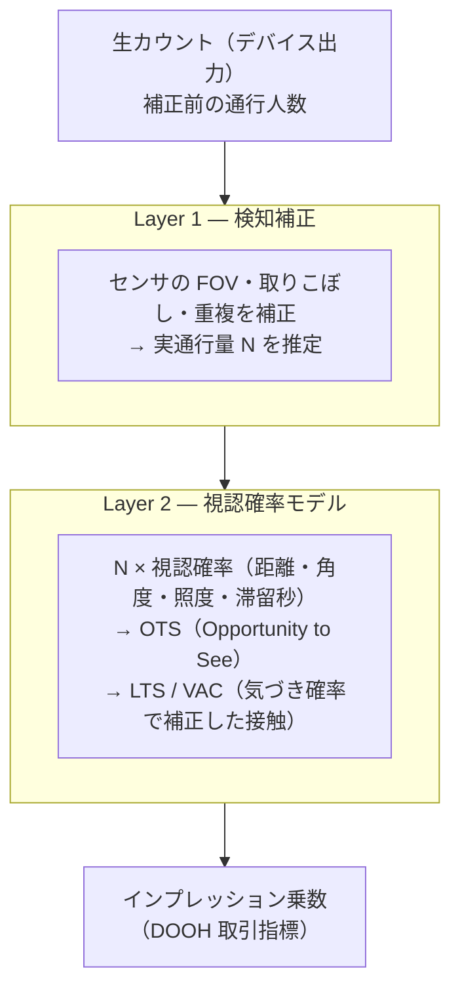
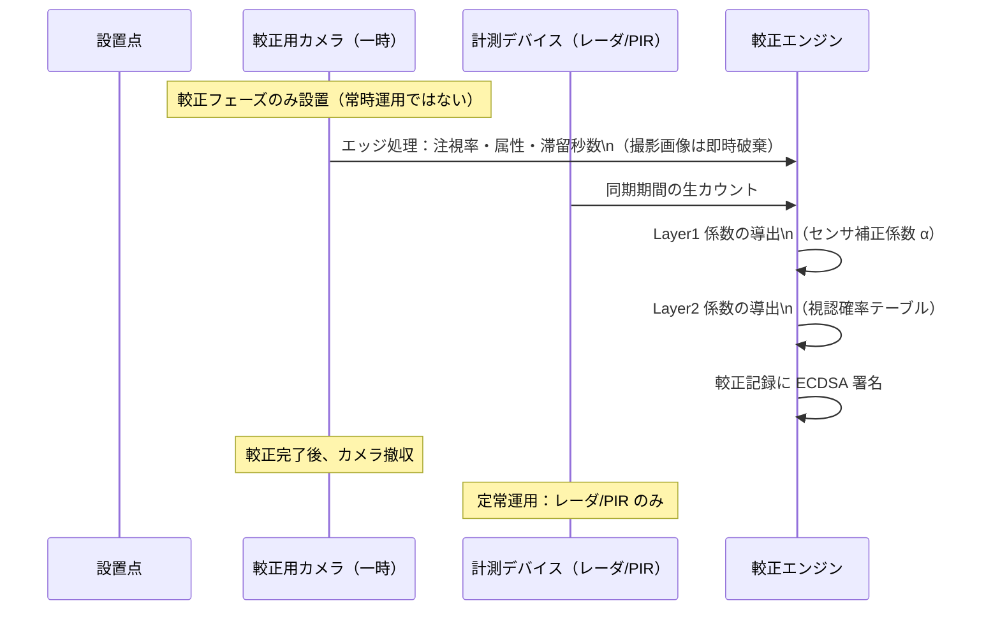
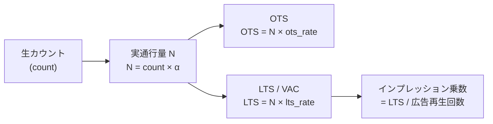

# Calibration

生カウントから視聴者数（OTS/LTS）を算出するための較正プロトコルと係数管理。手順・係数・実施記録はすべてバージョン管理し、署名して保管する。

---

## 較正の2層構造



両層の手順は公開・バージョン管理し、独立に再実行できる状態を保つ（**較正のプロベナンス**）。

---

## 較正フェーズ（一時的なカメラ設置）



- 較正用カメラは係数を作るための**一時設置**。常時運用ではない
- 較正後は撤収し、定常はレーダ/PIR のカウントのみ
- 較正の実施記録も署名して保管

---

## 較正係数の管理

### バージョン体系

```
calib_ver: cal-{YYYY-MM}[-{site_id}]
例: cal-2026-05, cal-2026-05-shibuya-01
```

各レコードの `calib_ver` フィールドが使用された係数バージョンを参照する。

### 係数ファイル構成

```
calibration/
├── coefficients/
│   ├── cal-2026-05/
│   │   ├── layer1_detection.json   # 検知補正係数
│   │   ├── layer2_visibility.json  # 視認確率テーブル
│   │   ├── metadata.json           # 実施記録・署名
│   │   └── README.md               # 実施条件・方法
│   └── ...
├── protocols/
│   ├── camera-calibration.md       # カメラ一時設置手順
│   ├── data-collection.md          # データ収集手順
│   └── validation.md               # 係数検証手順
└── README.md
```

### Layer 1 係数（検知補正）

```json
{
  "calib_ver": "cal-2026-05",
  "sensor": "mmwave-60ghz",
  "fov_correction": 1.12,
  "miss_rate": 0.08,
  "double_count_rate": 0.03,
  "alpha": 1.17,
  "valid_from": "2026-05-01T00:00:00+09:00",
  "valid_to": null,
  "sig": "ecdsa-p256:..."
}
```

### Layer 2 視認確率テーブル（例）

```json
{
  "calib_ver": "cal-2026-05",
  "lts_table": [
    { "hour": 8,  "day_type": "weekday", "ots_rate": 0.65, "lts_rate": 0.42 },
    { "hour": 12, "day_type": "weekday", "ots_rate": 0.71, "lts_rate": 0.48 },
    { "hour": 18, "day_type": "weekday", "ots_rate": 0.68, "lts_rate": 0.45 },
    { "hour": 12, "day_type": "weekend", "ots_rate": 0.75, "lts_rate": 0.52 }
  ],
  "sig": "ecdsa-p256:..."
}
```

LTS テーブルを時間帯・曜日で展開したものが DOOH の**インプレッション乗数相当**として機能する。

---

## 指標変換の全体フロー



---

## プライバシー対応（較正フェーズ）

較正フェーズのカメラ使用は「カメラ画像利活用ガイドブック ver3.0」に該当しうる。

| 対応項目 | 内容 |
|---------|------|
| エッジ処理 | 特徴量の集計のみ外部化。撮影画像は即時破棄 |
| 画像の外部保存禁止 | 係数導出後の画像・特徴量は保持しない |
| 事前告知 | 設置前の案内・周知。掲示運用が得意な halfwaytheir に親和的 |
| 記録の署名 | 較正実施記録・破棄記録も ECDSA 署名して保管 |

---

## 次工程

- [ ] 較正プロトコルの確定（カメラ一時設置の手順・期間・破棄手順・記録の署名）
- [ ] Layer 1 係数の初回導出（PoC 設置点での実測）
- [ ] Layer 2 視認確率テーブルの初回作成
- [ ] 係数検証ツールの実装（独立再計算・公表値との一致確認）
- [ ] 係数のバージョン管理フロー整備
