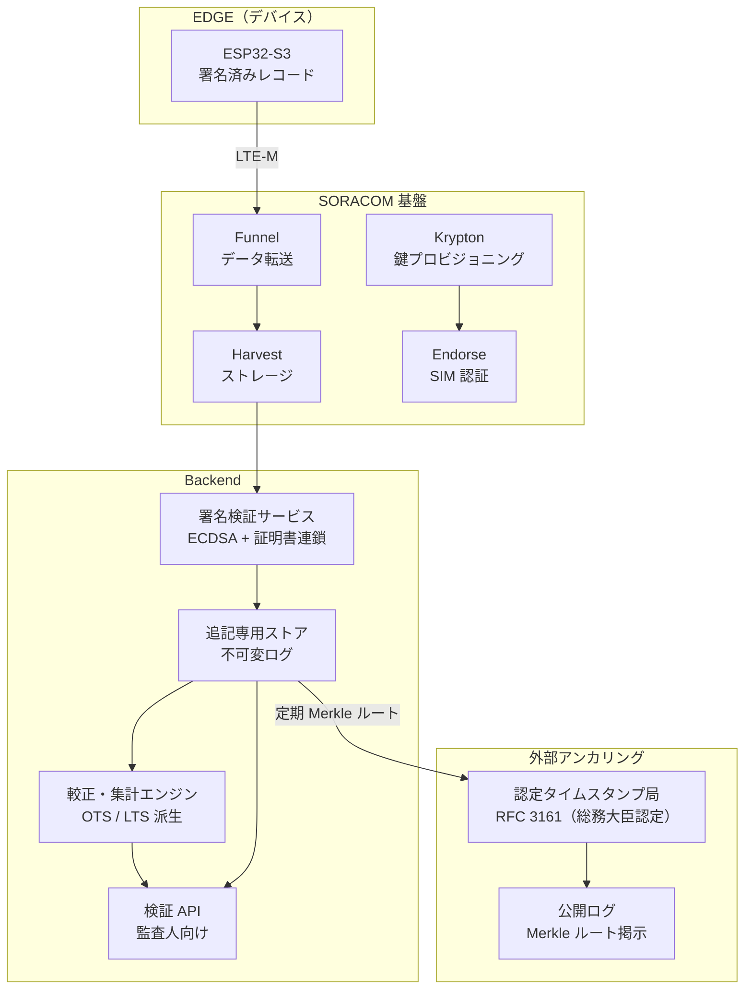
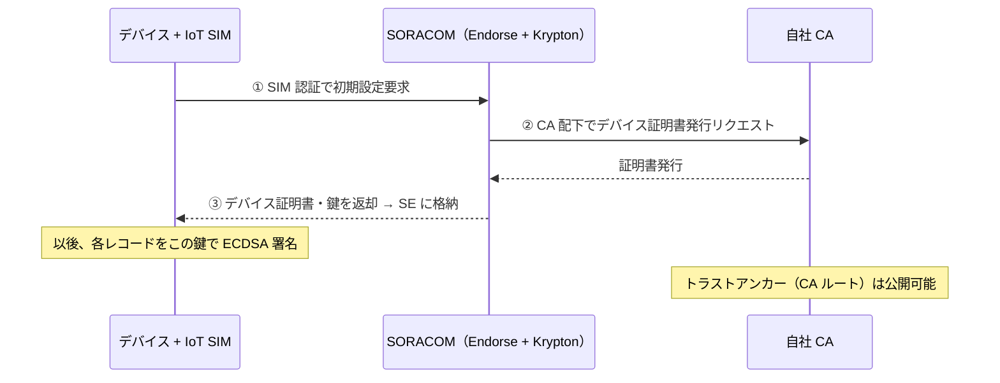
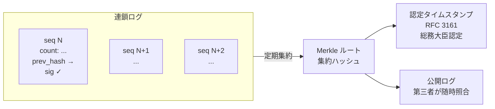
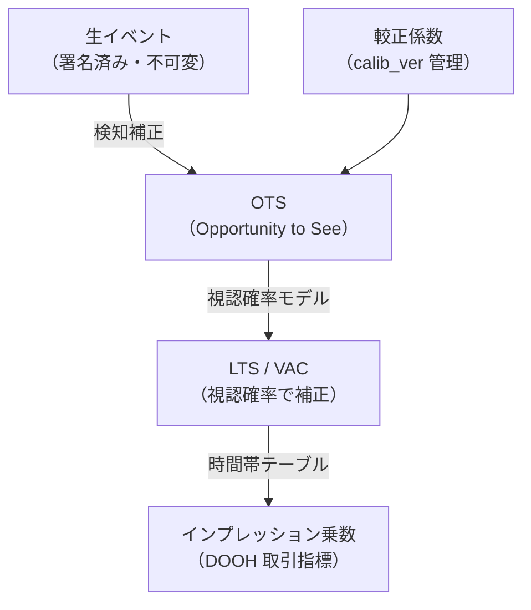
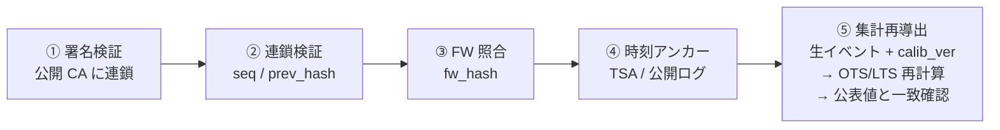

# Cloud / Backend

エッジから受信した署名済みレコードを検証・保管・集計し、外部アンカリングと検証者向けインターフェースを提供するバックエンド。

---

## アーキテクチャ

---

## 鍵管理・デバイス認証（SORACOM Krypton）

- SIM をハードウェアの root of trust とし、デバイス固有の鍵・証明書をブート時に動的プロビジョニング
- 秘密情報をファームウェアに焼き込む必要がなく、全デバイスで共通イメージを使用可能
- 自社登録 CA のルートは公開でき、第三者がデバイス証明書の連鎖を検証可能

---

## 外部アンカリング

一定期間ごとに連鎖ログの Merkle ルートを外部 TSA へ提出し RFC 3161 タイムスタンプを取得。「このレコード群が、その時刻に存在し、後追いで捏造されていない」ことを独立に証明する。

**認定タイムスタンプ事業者（例）：**  
セイコーソリューションズ / アマノ / 三菱電機インフォメーションネットワーク / GMO グローバルサイン

---

## データフロー

- 生イベントと派生集計（OTS/LTS）は別テーブルに分離
- 較正バージョン（`calib_ver`）で参照し、検証者が「生データ + 公開された較正手順」から最終値を再計算可能
- 「数字を後でいじった」疑義を構造的に排除

---

## 第三者検証フロー

監査人は **鍵と公開された方法論だけで**、数字の出所・不改変・最終集計を独立に確認できる。プライバシー（PII なし）と検証可能性（生データ全開示可）が相互に補強し合う。

---

## 技術スタック（予定）

| コンポーネント | 技術候補 |
|--------------|---------|
| 受信・転送 | SORACOM Funnel → Harvest |
| 署名検証 | Node.js / Go（ECDSA P-256） |
| 不可変ストア | AWS DynamoDB（append-only）/ Timestream |
| 集計エンジン | Python / Spark（較正・OTS/LTS 計算） |
| 外部アンカリング | RFC 3161 TSA クライアント |
| 検証 API | REST / GraphQL |

---

## 次工程

- [ ] SORACOM Funnel → バックエンド受信の試験（Phase 2）
- [ ] 署名検証サービスの実装
- [ ] 追記専用ストアの設計・構築
- [ ] 較正・集計エンジンの実装（Phase 2）
- [ ] RFC 3161 TSA アンカリングの統合（Phase 2）
- [ ] 検証 API の設計・公開（Phase 3）
