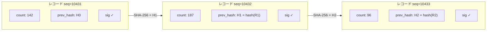
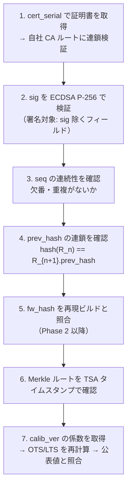

# データモデル

署名対象レコードのスキーマ定義と、ハッシュ連鎖・派生集計の仕様。

---

## 署名対象レコード（v1）

スキーマ名: `halfwaytheir.count.v1`

```json
{
  "schema":       "halfwaytheir.count.v1",
  "device_id":    "hwt-poster-0007",
  "cert_serial":  "krypton:...",
  "fw_hash":      "sha256:...",
  "seq":          10432,
  "prev_hash":    "sha256:...",
  "window_start": "2026-06-06T12:00:00+09:00",
  "window_sec":   900,
  "count":        187,
  "sensor":       "mmwave-60ghz",
  "calib_ver":    "cal-2026-05",
  "time_src":     "nitz",
  "sig":          "ecdsa-p256:..."
}
```

### フィールド定義

| フィールド | 型 | 必須 | 説明 |
|-----------|-----|------|------|
| `schema` | string | ✅ | スキーマバージョン識別子 |
| `device_id` | string | ✅ | デバイス固有 ID |
| `cert_serial` | string | ✅ | 発行済みデバイス証明書のシリアル（Krypton プロビジョニング） |
| `fw_hash` | string | ✅ | 走行中ファームウェアの SHA-256（Phase 2 以降） |
| `seq` | uint64 | ✅ | 連番（欠落/差込検知） |
| `prev_hash` | string | ✅ | 直前レコードの SHA-256（ハッシュ連鎖） |
| `window_start` | ISO8601 | ✅ | 集計ウィンドウの開始時刻（タイムゾーン付き） |
| `window_sec` | uint32 | ✅ | 集計ウィンドウの秒数（標準: 900 = 15分） |
| `count` | uint32 | ✅ | **補正前の生カウント**（OTS/LTS への変換は較正レイヤーが担う） |
| `sensor` | string | ✅ | センサ種別（`mmwave-60ghz` / `tof-multizone`） |
| `calib_ver` | string | ✅ | 使用した較正係数バージョン（`cal-{YYYY-MM}`） |
| `time_src` | string | ✅ | 時刻の出所（`nitz` / `ntp` / `rtc`） |
| `sig` | string | ✅ | ATECC608B による ECDSA P-256 署名 |

---

## ハッシュ連鎖



### ハッシュ計算対象

```
hash_target = JSON.stringify({
  schema, device_id, cert_serial, fw_hash,
  seq, prev_hash,
  window_start, window_sec, count,
  sensor, calib_ver, time_src
})

prev_hash_next = SHA-256(hash_target)
```

`sig` フィールドは除外した上でハッシュを計算し、`sig` はそのハッシュ値に対して ECDSA 署名する。

---

## 派生集計テーブル

生イベントと派生集計（OTS/LTS）は**別テーブル**に分離する。必ず `calib_ver` と元レコード群を参照可能にする。

### OTS / LTS レコード

```json
{
  "schema":       "halfwaytheir.derived.v1",
  "device_id":    "hwt-poster-0007",
  "calib_ver":    "cal-2026-05",
  "window_start": "2026-06-06T12:00:00+09:00",
  "window_sec":   900,
  "raw_count":    187,
  "traffic_n":    219,
  "ots":          155,
  "lts":          100,
  "source_seq_range": [10432, 10432]
}
```

| フィールド | 説明 |
|-----------|------|
| `raw_count` | 生カウント（元レコードの `count`） |
| `traffic_n` | 検知補正後の実通行量（Layer 1） |
| `ots` | Opportunity to See（Layer 2 前段） |
| `lts` | Like-to-See / VAC（Layer 2 後段） |
| `source_seq_range` | 参照した生イベントの seq 範囲 |

---

## 初期レコード（genesis）

連鎖の最初のレコードは `prev_hash` に特別値を使用する。

```json
{
  "seq": 0,
  "prev_hash": "sha256:0000000000000000000000000000000000000000000000000000000000000000"
}
```

---

## 検証手順



監査人は鍵と公開された方法論だけで、数字の出所と不改変を確かめ、最終集計を独立に再計算できる。
