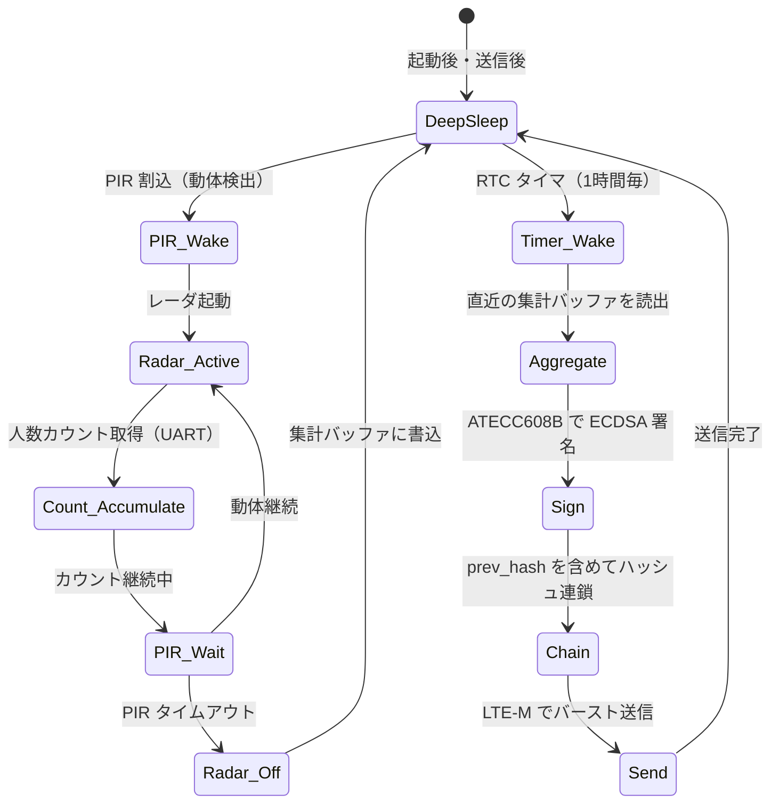
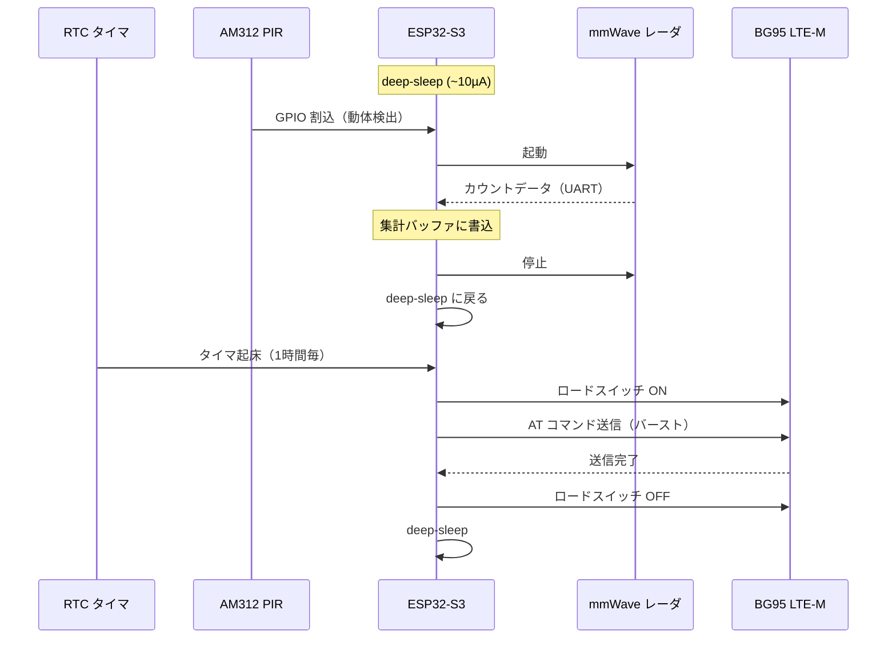

# Firmware

ESP32-S3 上で動作するファームウェア。PIR 起床 → レーダ計測 → 集計 → SE 署名 → ハッシュ連鎖 → LTE-M 送信 → ディープスリープ のサイクルを管理する。

---

## 動作フロー



---

## ファームウェア構成

```
firmware/
├── main/
│   ├── main.c              # エントリポイント・スリープ管理
│   ├── sensor_radar.c      # mmWave レーダ UART ドライバ
│   ├── sensor_pir.c        # PIR GPIO 割込ハンドラ
│   ├── aggregator.c        # 15分粒度の集計ロジック
│   ├── signer.c            # ATECC608B ECDSA 署名
│   ├── chain.c             # ハッシュ連鎖管理（prev_hash）
│   ├── transport.c         # LTE-M（BG95）送信制御
│   └── record.h            # データモデル構造体
├── components/
│   ├── atecc608/           # SE ドライバ（cryptoauthlib）
│   ├── bg95/               # Quectel AT コマンドライブラリ
│   └── ms60/               # MS60-1211S80M UART プロトコル
└── CMakeLists.txt
```

---

## データモデル（PoC フェーズ）

各レコードは署名対象フィールドをすべて含む。

```json
{
  "schema":       "halfwaytheir.count.v1",
  "device_id":    "hwt-poc-0001",
  "fw_hash":      "sha256:...",
  "seq":          10432,
  "prev_hash":    "sha256:...",
  "window_start": "2026-06-06T12:00:00+09:00",
  "window_sec":   900,
  "count":        187,
  "sensor":       "mmwave-60ghz",
  "calib_ver":    "cal-2026-05",
  "time_src":     "nitz",
  "sig":          "ecdsa-p256:..."
}
```

> `count` は **補正前の生カウント**。OTS/LTS への変換は較正レイヤーが担う。

---

## ハッシュ連鎖

```mermaid
flowchart LR
    R1["seq 10431\ncount: 142\nprev_hash: H0\nsig: ✓"]
    R2["seq 10432\ncount: 187\nprev_hash: H1\nsig: ✓"]
    R3["seq 10433\ncount: 96\nprev_hash: H2\nsig: ✓"]

    R1 -->|hash(R1) = H1| R2
    R2 -->|hash(R2) = H2| R3
```

連番（`seq`）と前レコードのハッシュ（`prev_hash`）を各レコードに含める。1件でも改変すると以降の連鎖検証が破綻する。

---

## 消費電力管理



---

## 開発環境

- **フレームワーク：** ESP-IDF v5.x
- **ビルド：** CMake / `idf.py build`
- **書込：** `idf.py -p /dev/tty.usbmodem* flash monitor`
- **SE ライブラリ：** Microchip CryptoAuthLib（I²C）
- **セキュアブート：** Phase 2 で有効化予定（`fw_hash` の計測はそれ以降）

---

## 次工程

- [ ] PIR 割込 + レーダ UART 受信の動作確認（DevKit PoC）
- [ ] 15分集計ロジックの実装・テスト
- [ ] ATECC608B ECDSA 署名の統合（Phase 2）
- [ ] ハッシュ連鎖の実装・連続性テスト
- [ ] BG95 AT コマンド + SORACOM 送信の動作確認（Phase 2）
- [ ] セキュアブート有効化・`fw_hash` 計測（Phase 2）
