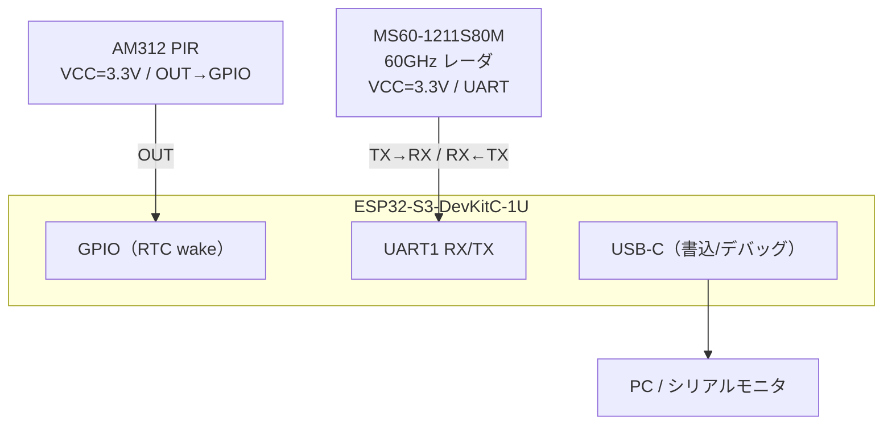
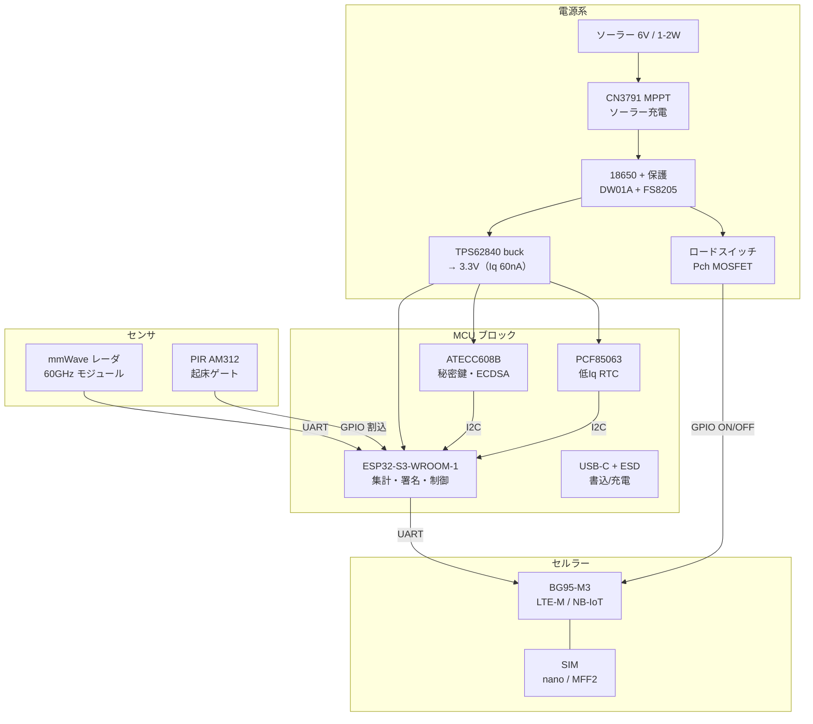
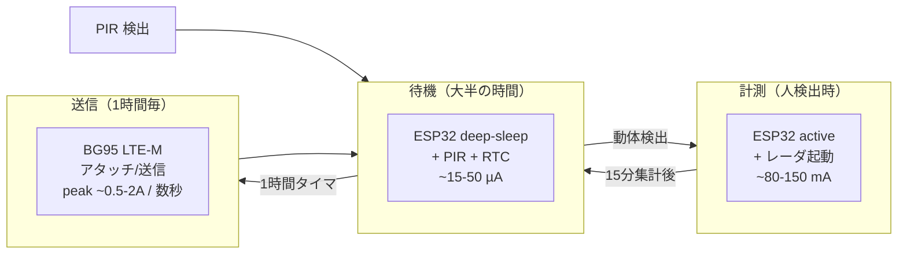

# Hardware

計測デバイスのハードウェア設計。RF を含む難所（mmWave・セルラー）は既製モジュールに任せ、自作部は「電源・充電・MCU・セキュアエレメント・I/O」を載せたキャリア基板に絞る。

---

## 設計方針

| 区分 | Tier A — PoC（現フェーズ） | Tier B — 統合（量産方向） |
|------|--------------------------|------------------------|
| MCU | ESP32-S3-DevKitC-1U（DevKit） | ESP32-S3-WROOM-1 をキャリア基板に直載せ |
| レーダ | MS60-1211S80M をコネクタ接続 | 同左（アンテナ一体のため常にモジュール） |
| PIR | AM312 モジュールをヘッダ接続 | 同左 |
| セルラー | BG95 ブレイクアウトをヘッダ装着 | BG95-M3 を基板直載せ + u.FL |
| SIM | nano-SIM ホルダ + SORACOM カード型 | SORACOM チップ型 SIM（MFF2）直はんだ |

---

## PoC 配線

### ピン割当（DevKit PoC）

| 信号 | ESP32-S3 GPIO | 接続先 |
|------|--------------|--------|
| PIR 割込 | GPIO4（RTC 対応） | AM312 OUT |
| RADAR TX | GPIO17（U1TXD） | MS60 RX |
| RADAR RX | GPIO18（U1RXD） | MS60 TX |
| 3.3V | 3V3 ピン | AM312 VCC / MS60 VCC |
| GND | GND | AM312 GND / MS60 GND |

---

## 量産キャリア基板ブロック構成

---

## 部品表（BOM）

### PoC フェーズ（現在）

| 部品 | 型番 | 購入済 |
|------|------|--------|
| MCU | ESP32-S3-DevKitC-1U（N8R8） | ✅ |
| PIR センサ | AM312 ミニ焦電 PIR センサモジュール | ✅ |
| mmWave レーダ | MS60-1211S80M（60GHz 1T2R） | ✅ |

### 量産キャリア基板（将来）

| 機能 | MPN（例） | パッケージ | 備考 |
|------|----------|-----------|------|
| MCU モジュール | ESP32-S3-WROOM-1-N8R2 | SMD module | 8MB Flash/2MB PSRAM |
| セキュアエレメント | ATECC608B-SSHDA-T | SOIC-8 | 秘密鍵封入・ECDSA 署名（I²C） |
| RTC | NXP PCF85063ATL | SO-8 | 低Iq 時計（~0.2µA）+ 32.768kHz |
| ソーラー充電 | CN3791（MPPT） | MSOP-10 | 1セル Li-ion、入力電圧追従 |
| 電池保護 | DW01A + FS8205A | SOT-23-6/SOP-8 | 過充放電・過電流保護 |
| 3.3V レギュレータ | TI TPS62840 | SOT-563 | 常時系。Iq 60nA buck |
| セルラーモジュール | Quectel BG95-M3 | LGA / ブレイクアウト | LTE-M/NB-IoT |
| SIM（試作） | nano-SIM ホルダ + SORACOM 3-in-1 | SMD | 量産は MFF2 へ |
| USB ESD | USBLC6-2SC6 | SOT-23-6 | USB-C D±/VBUS 保護 |

---

## 電源・消費電力

| 状態 | 概算電流 | 備考 |
|------|---------|------|
| 待機（PIR 監視） | ~15–50 µA | 大半の時間 |
| 計測（人検出時） | ~80–150 mA | 通行中のみ |
| 送信（1時間毎） | peak ~0.5–2 A / 数秒 | バルクコンデンサ必須 |
| 日間消費（試算） | ~1–3 Wh/日 | 歩行者量・設置時間に依存 |

2W ソーラーで実効日照 3h なら ~6 Wh/日 採取でき、消費に対し十分な余裕がある。18650 (~10 Wh) が曇天時のバッファ。

---

## PCB 設計ガイド（量産フェーズ向け）

- **層構成：** 2層 FR4 1.6mm（高速信号なし、RF はモジュール側）
- **アンテナ・キープアウト：** ESP32-WROOM の PCB アンテナ部は基板端に張り出し、直下・周囲の銅箔と GND を除去
- **レーダ指向：** レーダモジュールは歩行帯へ向くようコネクタで端部に。アンテナ前方に金属・GND を置かない
- **表面処理：** 屋外耐食性のため ENIG 推奨
- **耐環境：** コンフォーマルコート前提（アンテナ・コネクタ・USB は除く）
- **JLCPCB デザインルール：** 最小線幅/間隙 6/6 mil、最小ドリル 0.3mm、ビア 0.3/0.6mm

---

## 次工程

- [ ] PoC: DevKit + MS60 + AM312 の動作確認・カウント精度評価
- [ ] 量産: KiCad ネットリスト作成（本 §結線一覧をベースに）
- [ ] 量産: ESP32-S3 ピン割当の確定表
- [ ] 量産: 電力収支の精密試算（設置点別）
- [ ] 量産: JLCPCB 発注用 Gerber / BOM / CPL 作成
